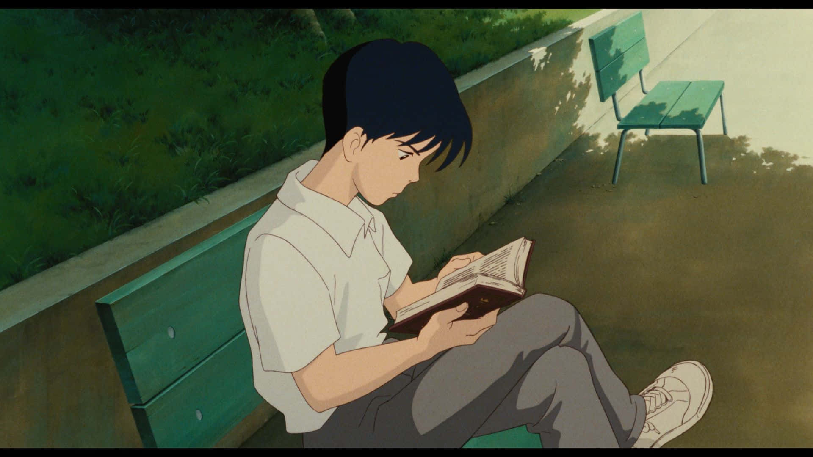

## I'm *Muhammad Shah*, a junior at Duke University studying Computer Science and Statistics. Currently, I'm working as a Software Engineer Intern at 10Pearls.

### Software
Property                 | Data  
-------------------------|------
Languages                |     
Frameworks & Libraries   |     
Web Technologies         |  
Tools                    |  

### About Me

- 🔧 **What I'm Up To:** Right now, I'm working on a fun little bingo game. It's been a great way to experiment with webhooks and an easy hands-on way for my siblings to see the daily games of our childhood *come to life* through code and creativity.
- 🚀 **What I Love:** I'm all about using tech to make life better and more interesting. Whether it's making an impact in a team or just a cool side project, I love the process of bringing ideas to life.
- 🧠 **What I'm Learning:** I'm exploring the world of AI and machine learning. It's a fascinating field, and I'm excited about the possibilities it holds.
- 🎨 **On the Creative Side:** I enjoy mixing creativity with technology. Designing user-friendly interfaces and crafting engaging user experiences are my jam. Oh and I also love to read *(explaining the cover photo).*

### Contact Me

- 
- 

---

*Another little fact about me: I am Pakistani and grew up in Lahore. Lahore's vibrant culture and the warmth of its people taught me the value of connection and storytelling. I try to bring a bit of that spirit into everything I do, especially in tech!*

*I'm always up for a chat, whether it's about tech, life, or just sharing a good story. Let's connect and see what cool stuff we can come up with!*
